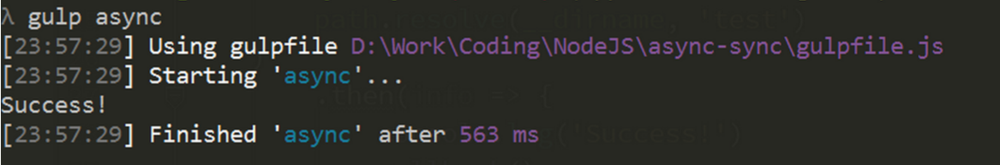
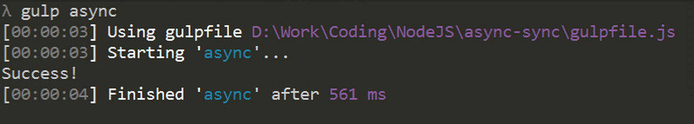
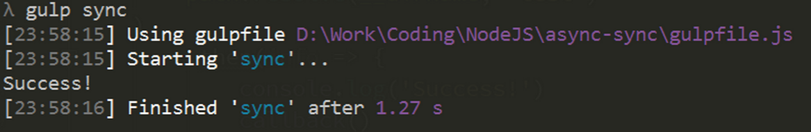
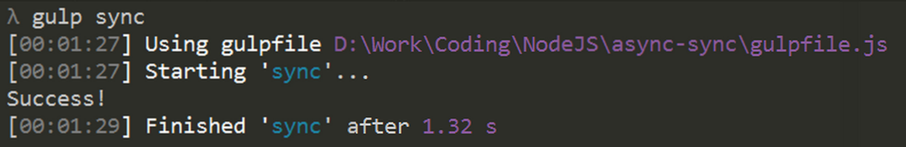

# async-sync

一个基于Gulp的测试异步(并行)和同步(串行)性能对比的测试项目

<br>

> EN-README Please move to: [Documentation](README.md)

<br>

## 描述

这里一共有2000个文件，每个文件有100行，一共`20w`行，每一行都需要处理。

`Async()`采用`promise.all()`对所有文件并行修改，以最后一个文件修改结束为终点;

`Sync()`采用`Generator`控制同步,文件串行修改,即后一个文件的读写会等待前一个文件的读写结束

耗时结果测试如下：


### Async





### Sync



- 这差距也太大了吧 !!!!
- 这差距也太大了吧 !!!!
- 这差距也太大了吧 !!!!


## 本地测试

可以clone本项目在你的本机上进行测试：

```
$ git clone https://github.com/toxichl/async-sync.git
```
安装依赖：

```
$ npm i 
```

> 说明：本测试是基于Gulp的，可以考虑全局安装一下Gulp。

初始化，如果存在旧的测试文件则删除，然后生成测试文件：

```
$ gulp init
```

异步（并行）测试：

```
$ gulp async
```

同步（串行）测试：

```
$ gulp sync
```

删除旧的测试文件：

```
$ gulp del
```


## 结论

某些允许使用并行控制的情况下，请尽量使用并行，以提高程序性能。


